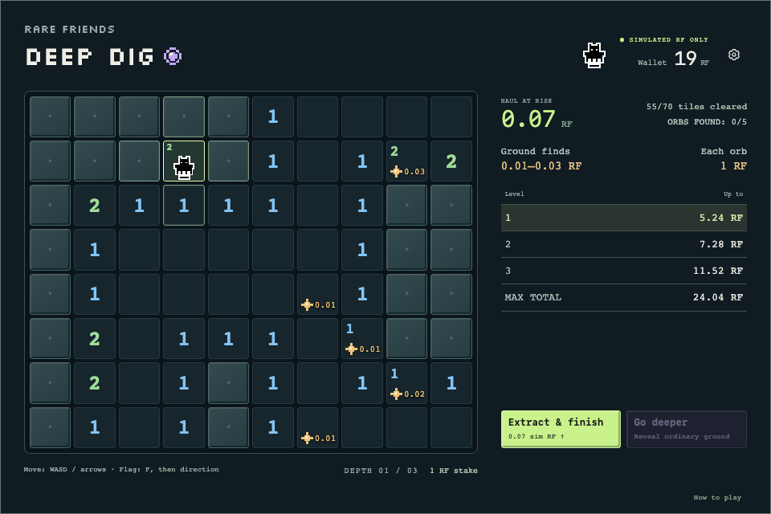

# Deep Dig — walk, find RF, extract

A **FriendSDK v0.1.2** simulated game with a wallet-gated submission preview and a preserved offline version. Move your canonical Rare Friend through a Minesweeper board, collect scattered RF finds and decide when to leave. Orbs and mines emit the same resonance: each new level has exactly **5 orbs and 5 mines**, shuffled into ten source tiles. There are three depths and one shared simulated pool in this browser.



**All RF is simulated.** The submission preview uses official wallet connection, fresh ownership checks and selected Friend artwork. It sends no signatures or transactions. The offline runner makes no external requests and keeps its existing browser saves.

## Wallet-gated submission preview

```sh
npm ci
npm run dev:deep-dig:submission
```

Open **http://localhost:4175** in a wallet-enabled browser. Connect a wallet owning a hardwired Generations Friend (generation ≥ 1) on Robinhood mainnet (4663), then select its artwork/number card. Use Settings → Choose Friend to reopen selection; the bottom identity buttons are hidden in both builds. Load more Friends fetches the next eight owned IDs and their artwork. Selection reuses those cached frames through the verified session, without a second artwork-loading screen. The initial owner-filtered transfer history is still read in full; RPC history limits remain. Wallet connection and public identity/artwork reads require no RF, private key or signature. The custom simulation starts with 20 RF for that selected Friend and a 1,000,000 RF pool. Gameplay and economy below are unchanged.

**Submission progress lasts only for the selected session.** Refresh, disconnect or changes to account/network/Friend discard that session, including its board and balance. Offline saves are never imported or written. Desktop uses 960×640; portrait content scrolls inside the runtime frame. Browser-wallet support comes from the SDK; WalletConnect and native wallet deep links are not supplied.

`npm run build:deep-dig:submission` produces local static files in `.friendsdk/`. Neither command accepts a deployment flag. See [submission draft and capability decisions](SUBMISSION.md) and [integration verification](SUBMISSION-CHECKS.md). The [public wallet-connected simulation](https://chimph.github.io/rf-deep-dig/) is hosted on GitHub Pages. The [Vibeathon entry](https://github.com/spokesz/rarefriends-vibeathon/pull/30) is submitted for review. No real-RF release has been performed.

## Run on computer

Node.js 22+ and npm. Dependencies are already installed; on another machine run `npm ci` first.

```sh
cd /path/to/deep-dig
npm run dev:deep-dig
```

Open **http://localhost:4173**. Keep the server running; refresh after edits. `npm run build:deep-dig` creates local files without publishing. This offline runner retains localhost:4173 and its saves. Use the separate submission command above for official wallet play.

## Phone on the same Wi-Fi

From the same folder:

```sh
npm run dev:deep-dig -- --host 0.0.0.0 --port 4174
```

Open **http://YOUR_COMPUTER_LAN_IP:4174**. Find the IP in macOS Wi-Fi → Details → TCP/IP, or `ipconfig getifaddr en0`. Desktop and landscape use the SDK’s 960×640 frame. Portrait phones show the same board as 8 columns × 10 rows, with information and a directional pad underneath, followed by entry/action controls. Scroll vertically when needed. Turning the phone preserves your board, flags and haul; movement always follows the visible directions. Each device/origin has a separate simulation; this is not networked multiplayer.

## Play and controls

1. Choose canonical sample Friend #7730 (Hoverer) or #3412 (Skeleton). Both share this browser's pool, with separate banked balances.
2. Choose a **whole-RF stake** from the entry buttons and pay once per expedition. The displayed rewards update immediately; Enter mine starts immediately and locks your selected stake. Depths 2 and 3 cost no additional RF.
3. Choose any tile for the first step of each board. That tile and its eight neighbors are ordinary ground. On keyboard, arrows/WASD move the starting cursor; Enter/Space places your Friend. Clicking/tapping a starting tile also works.
4. After placing your Friend, **arrows/WASD walk one tile per press**. You can also tap one of the four neighboring tiles or use the on-screen direction buttons. Movement is up, down, left or right; there is no diagonal movement, remote digging or chording. Holding a key does not run through several tiles.
5. Walking onto covered ground reveals it. Safe zero regions open automatically, revealing clues and any RF finds. **Revealing a find does not collect it: walk onto its tile to add the RF to your haul.** Most ordinary tiles are empty. Revisiting a collected find cannot pay again. Adding RF to the haul produces a brief gold shimmer of lines around your Friend; merely revealing a find does not.
6. Numbers count **all resonance sources in all eight surrounding cells**, including both orbs and mines. Counts remain fixed after a source opens. Use these clues to identify safe ground and likely sources.
7. For keyboard flagging, **tap F, then an arrow/WASD direction** to mark or unmark that neighbor without moving. Eligible neighboring tiles highlight while this is armed; a successful flag returns to walking. F or Escape cancels. Choosing a revealed tile or the board edge keeps it armed so you can choose another direction. On mobile, tap the **centre flag button**, then a direction to place or remove a flag without moving. Tap the flag button again to cancel; a successful flag returns to movement. Only arrows toward covered neighbouring tiles highlight and remain enabled in flag mode (including existing flags to remove). Choose your first tile before using this shortcut. You can still right-click or hold any covered tile for **450 ms** to flag remotely. Flags are guesses, not proof, and block normal walking into the tile. To try one, stand beside it, attempt to walk into it, and explicitly confirm **Risk this tile**. An incorrectly flagged ordinary tile has only its ordinary contents. The game never flags automatically.
8. An unflagged covered neighbor is entered directly and may contain a source. An orb pays its depth's prize immediately. **A mine loses the entire collected haul**, including earlier depths' rewards; previously banked RF stays safe. A mine plays a red burst on the board first; after 650 ms, a card automatically offers Try again. Movement keys cannot dismiss it or start another run. Only the mine you hit is red; unopened resonance sources use hollow rings (◎), purple outside and red inside on a blue tile, regardless of whether they hide an orb or a mine. Recovered orbs keep their filled ring (◉). Every orb, including the first on each level, shimmers without pausing movement or opening a popup. Clear-ground/orb progress and the Go deeper button show what remains before descent. The underlying RF outcome is settled immediately; presentation never changes rewards.
9. **Reveal all ordinary tiles and recover an orb on the current level to unlock free descent.** An orb recovered earlier on that level counts. Collecting every visible ground find is optional; uncollected rewards return to the pool when you leave. A new level requires its own orb. Depth 3 is the bottom. Additional orb attempts on the same board still pay when successful.
10. **Extract & finish anytime** to bank all RF you have actually collected and end the entire run, even with unfinished ground or no orb. Visible but uncollected finds are not banked. Extracting an empty haul still ends the run without refunding entry. A new run requires a new entry fee. Extraction uses one review screen with a large **SIM RF TO BANK** amount. **Keep digging** cancels without changing the run; **Extract and return to camp** banks the haul and returns directly to camp in one saved update. Idle expiry still takes priority. Previously saved extraction results remain readable.
11. After **nine minutes idle**, a warning offers Continue playing or extraction. At **ten minutes idle**, the game ends and returns only the original entry stake to your wallet. The entire haul is discarded, even when it exceeds your entry. A completed mine loss cannot be refunded.

Enter/Space acts on the focused tile; E is also supported. It attempts the first step or a legal neighboring step. Flags can be removed from a distance. Your Friend keeps the same canonical front-facing artwork in every movement direction. Flagging uses the direction you press, not the way the artwork faces. Menus pause board input but not inactivity. There is no time limit while actively playing or health bar. Sound defaults to on after the first player interaction and remembers the sound icon setting in this browser. A saved mute choice remains respected. The wallet host stores only this UI preference, separately from simulated progress. Movement uses the SDK select blip; flag placement/removal uses its two-note action-ready cue. Collecting a ground find adds a quiet 280 ms shimmer over the movement blip; empty or previously collected tiles do not shimmer. Orb discoveries play an original rising crystal chime, and mine hits play an original gravelly crunch with a low thud. The procedural sounds are shared by both builds, require no downloads, and stop on mute, pause, hiding or session disposal. Reduced motion replaces the 600 ms animated pickup shimmer with brief static rays.

The header shows your **Wallet**. The info sidebar shows **Orbs found: N/5**; only recovered orbs count, never flags. Odds and mine counts are not displayed. The side panel shows collected haul, ground/orb rewards and maximum rewards per level. There is no Base camp label, global-pot total/percentage or Expedition log menu. An older saved board uses its actual orb total until you leave that level.

All ordinary ground forms one connected area using the four walking directions. Every resonance source has an ordinary neighbor from which it can be approached. In particular, two sources cannot seal an ordinary corner off from the rest of the board. This guarantees physical access, **not a puzzle solvable without guessing**. Generation never looks at whether a source is an orb or mine, so the reachability rule does not distinguish their outcomes.

## Current playtest economy

All RF is simulated, using bigint units (1 RF = 10^18 units). Each new 10×8 level contains exactly five orbs, five mines and seventy ordinary tiles. Twelve ordinary tiles carry scattered finds; the other fifty-eight pay nothing. Clues count both kinds of source. Collect one orb and reveal all ordinary ground to descend; extra orb attempts are optional.

These are the amounts for a **1 RF stake**. Multiply every prize and maximum by the selected stake:

| Level | Ground finds | All ground RF | Each orb | Maximum level reward |
| --- | --- | ---: | ---: | ---: |
| 1 | 4 each of 0.01 / 0.02 / 0.03 | 0.24 | 1.00 | 5.24 RF |
| 2 | 4 each of 0.02 / 0.04 / 0.06 | 0.48 | 1.36 | 7.28 RF |
| 3 | 4 each of 0.03 / 0.06 / 0.09 | 0.72 | 2.16 | 11.52 RF |

For example, a 5 RF stake shows maxima of **26.20 / 36.40 / 57.60 RF**. These are separate level totals, not a cumulative haul. The maximum entire run is **24.04 × stake**. Reaching that maximum means recovering every orb and every ground find without hitting any mine.

Fresh simulations have two 20 RF wallets and a 1,000,000 RF pool. Existing saves receive a **one-time simulated pool top-up** to 1,000,000 RF outside wallets, preserving the current board, wallet balances, collected haul and lost-loot provenance. The added RF is recorded as issued supply. Reloads and subsequent play do not refill it.

The entry cap is the smaller of clean-rounded wallet funds and **cleanRoundDown(available RF / (24.04 × 500))**. Rounding always goes down: 16 becomes 15, 67 becomes 60. Use steps of 1 below 10, 5 for 10–49, 10 for 50–99, and the same pattern at larger magnitudes. At 1,000,000 available RF, the pool cap is 80 RF; the fresh 20 RF wallet limits its choices to 1, 2, 5, 10 and 20 RF. Each new admission rechecks the current cap. A declined entry changes nothing.

**All three levels are reserved before charging/starting the game.** Current prizes and future backing cannot be spent by another admission. A new run can always descend when its gameplay conditions are satisfied, even if free pool funds fall to zero. Descent returns uncollected current rewards and transfers the next level's already reserved backing into its caches. The stake never changes mid-run. The pool controls how much may be staked; it does not change an admitted run's prize multiplier.

On collection, reward reserve becomes carried haul. On extraction, carried haul goes to the wallet and all unused backing returns to the pool. A mine or abandonment returns the haul and all unused backing to the pool. Lost-haul tags identify a subset of pool funds, never extra money. Recovered provenance does not increase a prize. At every transition:

**Wallets + free pool + uncollected current rewards + future reserves + carried haul = recorded issued RF.**

After failure, the lost haul is shown with a separate **+ [stake] RF entry** line, in the sidebar beside the board. This explains the already-paid entry cost; it does not debit the wallet again or add entry to the lost-haul ledger. Older fixed-entry saves show + 1 RF entry.

Sources are sampled without replacement. The costs, rewards and reservation rules above describe the implemented simulation; they do not promise individual outcomes or secure real-value play.

## Idle cancellation

The clock starts at entry. Accepted steps, reveals, flag changes, descent and Continue playing reset it. Invalid or blocked moves, animations, opening menus and refreshing do not. The nine-minute warning stays out of the way of an already open menu; the ten-minute expiry still applies. At the deadline, cancellation takes priority over any late action or open confirmation.

Expiry releases all current/future backing, returns the haul to the pool and refunds the original stake exactly once from that released value. The result shows both the returned entry and discarded haul. The original timestamp is saved, so reopening after expiry settles immediately. Older active saves without a timestamp receive one ten-minute grace window on their first load after this update; their board and balances are preserved.

This local prototype uses the computer clock. A suspended or closed browser settles when execution resumes or the game is reopened. A future shared service must own the clock and atomic settlement; the prototype is not a multiplayer timing or anti-cheat implementation. Details and reproduction commands: [IDLE-TIMEOUT-DESIGN.md](IDLE-TIMEOUT-DESIGN.md).

## Committed boards, saves and migration

Admission commits the shuffled source-placement order, the shuffled five-orb/five-mine assignment, and a separate shuffle of the ground-find rewards. The first step determines source placement around its protected area while preserving connected ordinary ground and an approach to every source. Geometry never consults the outcomes. Clues and reward positions remain fixed after that first step. Reloading retains the board, position, facing, flags, collected finds and haul.

`deep-dig.offline.v4` stores the walking state, locked stake, future reserves and issued supply. Existing v4 random-split boards retain their original 8/12/16-source geometry and backed prizes, including old 0.80 RF level-1 orbs. They are never rerolled; the next level uses five/five rules. Older active runs without full future backing acquire it when they descend after the one-time seed upgrade. Old v1/v2/v3 keys remain untouched. Migration preserves banked balances, banks any old carried haul, and returns old uncollected reserves. It also merges the separate v1/v2 lost pools into the single pool; v3 loss tags are already part of that pool and are not added again. The retired expedition ends without a loss. Subsequent saves use v4.

One active tab per origin. Another tab changing the save pauses this tab. Invalid saves fail closed with explicit reset controls. Browser state and RNG are inspectable: there is no secure server ledger, anti-cheat guarantee or real-value guarantee. Devices, ports and hostnames have independent saves. Hundreds of simultaneous players and a genuinely global service are outside this local build.

## SDK integration and sources

Initialized from `examples/starter` using the recommended SDK init flow. Upstream source: https://github.com/spokesz/friendsdk, base commit `da4828f8ec49d8ac5c24556908bd4cd653f8db67`, original SDK v0.1.0; upgraded to v0.1.2 at `762d6f58a73ace723f7f82dc1a61bfa036c21edc`.

The preserved offline host uses SDK `GameFrame`, its sample selector and confirmation UI, `GameMenu`, and the exported SDK sound renderer through the local `createDeepDigSoundKit`. Its playback lifecycle is adapted from the Apache-2.0 SDK sound kit; original orb and mine synthesis lives in `sounds.ts`, with no recordings or third-party samples. SDK sound source and provenance are unchanged. The offline runner does not mount `GameHost`/`GameSession`; the submission runner does. Samples are explicitly labeled **no ownership claim**.

The fixed SDK `buy / play / settle / redeem` pack protocol does not model walking-board losses or extraction. `engine.ts` supplies the atomic local simulation; `board.ts` supplies deterministic connected geometry. The default `index.tsx` accepts the official `GameComponentProps`; shared `view.tsx` receives state/actions and canonical sprites from either adapter. The runtime is based on pinned official v0.1.2 with a local, read-only picker extension: Settings can request the trusted selector, owned-Friend metadata loads eight IDs per page, and the host displays canonical artwork cards. This extension must travel with the source; it is not an upstream v0.1.2 capability. Real identity is integrated for the submission preview; durable online progress and real-value actions remain future work.

`canonical-sprites.ts` copies the SDK's canonical samples from block **66188037**; only the public import path changed. `spriteFrame` and `decodeGenerationSprites` preserve the black mask pixels with the clipped white halo. The offline character uses the bundled front/down idle frame 0; the submission reads the corresponding selected token frame: its face does not turn or animate as it moves. `world.ts` draws at integer 2× logical pixels with no smoothing, recoloring or rotation; the fixed game frame scales on smaller screens. Pickup rays are a separate visual effect around the character, not a change to its pixels. The complete square artwork has its own lower tile region; the clue has a separate strip above, so a wide Friend is not cropped or covered by the number. The SDK decodes native 16×16 masks. Its optional world renderer defaults to 5× (80×80) and permits integer scales through 8× (128×128); 128×128 is a permitted scaled size, not a required native resolution. See [sprite decoding](https://github.com/spokesz/friendsdk/blob/main/src/generation-sprites.ts) and [renderer scaling](https://github.com/spokesz/friendsdk/blob/main/src/friend-world.ts). All surrounding board graphics are original CSS/DOM and local SVG artwork. Sound provenance remains in `assets/sound-provenance.json`. SDK `NOTICE.md` and the upstream Apache-2.0 source license are included.

The DEEP DIG title and short camp catchphrase use locally bundled Silkscreen (SIL Open Font License, included in `fonts/Silkscreen-OFL.txt`). The font is embedded in the game stylesheet for offline play. Board icons use local 16×16 vectors in `pixel-art.tsx`. Square interface panels, off-white text, hard shadows and a faint dotted camp background echo the Rare Friends visual style. The board keeps its original rounded surround, softly bevelled covered tiles, darker revealed ground and blue-green background. Unoccupied orbs sit in the tile centre. Ground-find icons sit along the bottom, aligned directly beneath the top-left clue number, with their RF amounts beside them. An occupied orb keeps its small marker above the Friend. Green remains the action colour; unopened sources have purple outer and red inner pixel rings on blue tiles. Orb, mine, flag, RF-find and direction icons share the same pixel grid; settings uses a standard outline cog. No font downloads are required. Offline art is bundled; submission Friend art uses public registry reads. The Friend's canonical artwork, layout and game rules are unchanged by this styling.

## Checks

```sh
npm run typecheck:deep-dig
npm run test:deep-dig
npm run build:deep-dig
npm run check:games
npm run check:deep-dig:browser
npm run check:deep-dig:idle
```

Engine and topology tests cover first-step safety, connected ordinary ground and source access, clue counts, legal movement, flags and explicit risk, flood reveal versus collection, once-only rewards, partial-board extraction, descent, backing, conservation, provenance, saves and migration. Timeout tests include exact deadlines, stale actions, one-time refunds, low free-pool funds and saved activity. Browser checks exercise desktop and emulated touch, including the warning, continued play, expiry over a pending confirmation and reopening an expired save. On a fresh test machine, install the browser with `npx playwright install chromium`.


Local testing wallets are saved separately in each browser. To add test funds without resetting your board or reward pool, open Settings and choose **Top up wallet to 500 RF**. This raises the selected Friend’s simulated balance to 500 RF (balances already above 500 are left alone); the added RF is tracked as newly issued simulation funds.

The board is 10 across by 8 down. Existing seven-row saves gain an empty bottom row, preserving all existing tiles and RF. Newly generated boards distribute the same five orbs, five mines and twelve finds over all 80 tiles. Payouts, stakes and total backing are unchanged.

UI: the header groups the canonical Friend with the wallet at the right. Movement buttons appear only on touch-capable devices; computers show a short keyboard hint. The pickaxe and board legend are removed; clue explanations remain in How to play.

The grid shares the title’s left edge. The reward/entry panel shares the grid’s top and bottom edges. Past expedition log messages are not displayed beneath the board; current input feedback and mine-result prompts remain available.

The enlarged grid uses 57.5% of the container width, with the same 3% spacing at the left edge, between columns and at the right edge. Its tiles remain square; controls and current feedback sit beneath the aligned board and reward panel.

The **TOTAL** row adds the three displayed level maximums (24.04 RF for a 1 RF stake, 120.20 RF for a 5 RF stake). It is the maximum gross reward across all three levels, not guaranteed winnings or profit after entry.

Ground finds and Each orb use larger text and sit together directly above the level table, without divider lines above either section.

Before entry, the reward summary and level table sit at the top of the side panel. Stake choices sit directly above Enter mine, and selecting a stake updates the preview immediately.

The entry selector always shows eight stakes: **1, 2, 5, 10, 20, 50, 80 and 100 RF**, in two rows. Stakes above the wallet or funding limit are greyed out and disabled instead of hidden; admission limits are unchanged. Intermediate cap values do not add extra buttons. Depth and stake appear below the board at the right; How to play sits in the bottom-right footer, and Abandon run is available in Settings.

Mine losses play their short burst, then show a **You hit a mine.** card with a Try again button over the board. Try again returns to stake selection without spending RF; press Enter mine to pay the selected simulated stake and play again. Lost haul and entry remain in the sidebar.

Choosing the first square uses the selected canonical Friend as a mouse cursor. Keyboard placement shows the same Friend on the focused square; touch places the Friend on the tapped square. Normal movement cursors return after placement.
